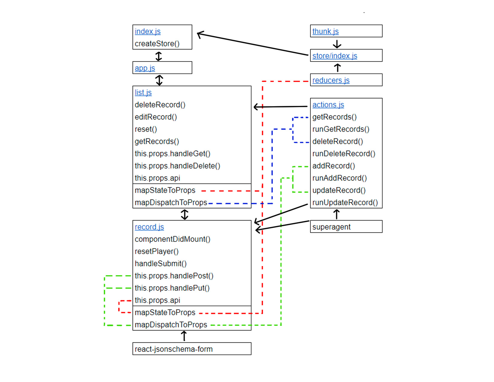

 LAB 34
=================================================

## Remote CRUD

### Author: Katherine Smith

### Links and Resources
* [Remote CRUD](https://codesandbox.io/s/5kzr9wj42n)

### Modules
#### `index.js`
- Imports App component
- Creates store and connects to store
- Contains Main component
  - Passes store down to App component
  - Renders App component

#### `app.js`
- Imports Records component
- Contains the App component
  - Renders Records component
- Exports App component

#### `list.js`
- Imports Record component
- Imports actions from the store
- Contains Records component
  - Contains own state for id, url, and record_id
  - Contains deleteRecord() method which handles deleting a record
  - Contains editRecord() method which handles changing id
  - Contains reset() method which handles setting id to null
  - Contains getRecords() method which handles getting the records
  - Renders the list of records and Record component
- Contains mapStateToProps() which maps api state to props
- Contains mapDispatchToProps() which maps api dispatch to props
- Exports connected Records component

#### `record.js`
- Imports Form from react-jsonschema-form
- Imports superagent
- Imports actions from the store
- Contains Record component
  - Contains own state for schema and url
  - Contains componentDidMount() which handles getting the schema
  - Contains resetPlayer() method which handles setting id to null
  - Contains handleSubmit() method which handles submitting the form
  - Renders the form
- Contains mapStateToProps() which maps api state to props
- Contains mapDispatchToProps() which maps api dispatch to props
- Exports connected Record component

### Store Modules
#### `store/index.js`
- Imports reducers and thunk
- Exports function to create the store

#### `actions.js`
- Imports superagent
- Contains getRecords(), deleteRecord(), addRecord(), and updateRecord() as actions to be dispatched
- Contains runGetRecords(), runDeleteRecord(), runAddRecord() and runUpdateRecord() as helper functions

#### `reducers.js`
- Maintains state for the store

#### `thunk.js`
- Provides middleware for the store

#### UML
